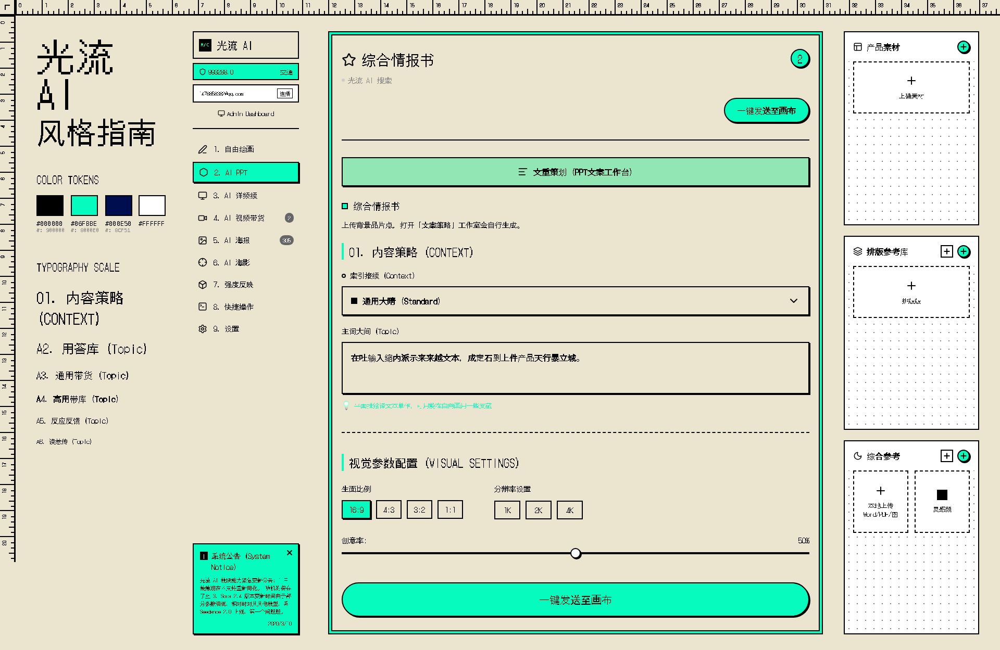

# Fuke UI

A 101% pixel-perfect clone of a retro UI design using React, Vite, and TypeScript.

## Preview



## Overview
This project is a meticulous pixel-perfect clone of a specific retro/pixel-art themed UI design. It features:
- **Pixel Fonts**: Utilizing `Zpix` and `DotGothic16` for that authentic retro feel, with anti-aliasing disabled for crisp edges.
- **Sharp Geometry**: 100% right angles with complex inset box-shadows to simulate layered borders.
- **Custom Patterns**: CSS radial gradients for authentic dot-grid notebook backgrounds.
- **Interactive Elements**: Fully interactive buttons, sidebars, and input areas.

## Tech Stack
- React 19
- Vite
- TypeScript
- Lucide React (for iconography)

## Getting Started

### Prerequisites
Make sure you have [pnpm](https://pnpm.io/) installed.

### Installation

```bash
# Install dependencies
pnpm install

# Start the development server
pnpm dev
```

### Build for Production
```bash
pnpm build
```
